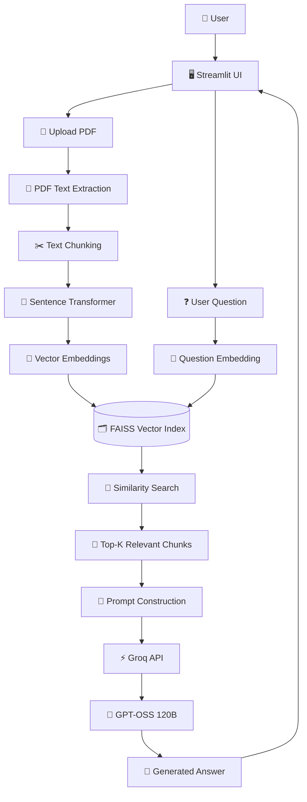
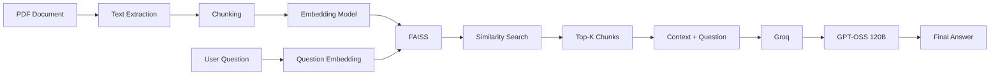

# 📚 PDF RAG Assistant

> An intelligent Retrieval-Augmented Generation (RAG) application that allows users to upload PDF documents and interact with them using natural-language questions.

Built with **Streamlit, FAISS, Sentence Transformers, Groq, and the open-weight GPT-OSS 120B model**.

[](https://www.python.org/)
[](https://streamlit.io/)
[](https://github.com/facebookresearch/faiss)
[](https://groq.com/)
[](https://www.sbert.net/)

---

## 🚀 Overview

**PDF RAG Assistant** is a Retrieval-Augmented Generation application designed to let users ask questions about their own PDF documents.

Instead of sending the entire document to an LLM, the application:

1. Extracts text from the uploaded PDF.
2. Splits the text into overlapping chunks.
3. Converts chunks into vector embeddings.
4. Stores embeddings in a FAISS vector index.
5. Converts the user's question into an embedding.
6. Retrieves the most relevant document chunks.
7. Sends the retrieved context to an open-weight LLM through Groq.
8. Generates a grounded answer based on the uploaded document.

This approach helps reduce irrelevant context and allows the LLM to answer questions using information retrieved directly from the user's document.

---

# 🏗️ System Architecture



---

# 🔄 RAG Workflow

The complete Retrieval-Augmented Generation pipeline works as follows:



---

# 🧠 How RAG Works in This Project

## 1. Document Ingestion

The user uploads a PDF through the Streamlit interface.

```text
PDF
 ↓
pypdf
 ↓
Extracted text
```

The application processes the PDF page by page.

---

## 2. Text Chunking

Large documents cannot efficiently be passed directly to an LLM.

Therefore, the extracted text is divided into smaller overlapping chunks.

Current configuration:

```text
Chunk Size:      1000 characters
Chunk Overlap:    150 characters
```

Example:

```text
Document
│
├── Chunk 1
├── Chunk 2
├── Chunk 3
├── Chunk 4
└── ...
```

The overlap helps preserve contextual continuity between neighboring chunks.

---

## 3. Embedding Generation

Each chunk is converted into a numerical vector using:

```text
sentence-transformers/all-MiniLM-L6-v2
```

Conceptually:

```text
"Artificial intelligence is..."
             ↓
      Embedding Model
             ↓
[0.021, -0.184, 0.733, ...]
```

These vectors represent the semantic meaning of the text.

---

## 4. Vector Storage

The generated embeddings are stored in:

```text
FAISS
```

FAISS performs efficient similarity search over the document embeddings.

The application uses normalized embeddings with inner-product similarity for semantic retrieval.

---

## 5. Question Retrieval

When the user asks:

```text
What is the main objective of this research?
```

the question is also converted into an embedding.

The application then searches FAISS for the most semantically relevant chunks.

```text
Question
   ↓
Question Embedding
   ↓
FAISS Similarity Search
   ↓
Top 5 Relevant Chunks
```

---

## 6. Context Construction

The retrieved chunks are combined with the user's question.

The LLM receives a prompt containing:

```text
Document Context
+
User Question
```

This allows the model to generate an answer grounded in the retrieved document content.

---

## 7. LLM Generation

The retrieved context is sent to Groq using:

```text
openai/gpt-oss-120b
```

The application instructs the model to answer using the supplied document context and avoid inventing information that is not present in the retrieved content.

---

# ✨ Features

* 📄 Upload PDF documents
* 🔍 Semantic document search
* 🧠 Open-source/open-weight embedding model
* 🗂️ FAISS vector database
* ⚡ Fast LLM inference through Groq
* 🤖 GPT-OSS 120B
* 💬 Natural-language question answering
* 📑 Page-aware retrieved context
* 🔎 View retrieved chunks
* 🔐 Secure API key handling through Streamlit Secrets
* ☁️ Streamlit Cloud deployment ready
* 🐍 Python-based implementation
* 🎨 Simple and interactive Streamlit interface

---

# 🛠️ Tech Stack

| Technology                | Purpose                            |
| ------------------------- | ---------------------------------- |
| **Python**                | Core programming language          |
| **Streamlit**             | Frontend and application interface |
| **pypdf**                 | PDF text extraction                |
| **Sentence Transformers** | Text embeddings                    |
| **FAISS**                 | Vector similarity search           |
| **Groq API**              | LLM inference                      |
| **GPT-OSS 120B**          | Answer generation                  |
| **NumPy**                 | Numerical operations               |
| **GitHub**                | Source control                     |
| **Streamlit Cloud**       | Deployment                         |

---

# 📁 Project Structure

```text
pdf-rag-assistant/
│
├── app.py
│
├── requirements.txt
│
├── .gitignore
│
└── README.md
```

### `app.py`

Contains the complete application including:

* PDF processing
* Text extraction
* Chunking
* Embedding generation
* FAISS indexing
* Similarity retrieval
* Prompt construction
* Groq API integration
* Streamlit UI

### `requirements.txt`

Contains all Python dependencies required to run the application.

### `.gitignore`

Prevents sensitive and unnecessary files from being committed.

---

# ⚙️ Installation

## 1. Clone the Repository

```bash
git clone https://github.com/bilalwebs/pdf-rag-assistant.git
```

Navigate into the project:

```bash
cd pdf-rag-assistant
```

---

## 2. Create a Virtual Environment

### Windows

```bash
python -m venv venv
```

Activate it:

```bash
venv\Scripts\activate
```

### Linux / macOS

```bash
python3 -m venv venv
```

```bash
source venv/bin/activate
```

---

## 3. Install Dependencies

```bash
pip install -r requirements.txt
```

---

# 🔑 API Configuration

The application requires a **Groq API key**.

Create a Streamlit secrets file:

```text
.streamlit/
└── secrets.toml
```

Add:

```toml
GROQ_API_KEY = "your_groq_api_key"
```

> ⚠️ Never commit your API key to GitHub.

Make sure `.streamlit/secrets.toml` is included in `.gitignore`.

---

# ▶️ Run Locally

Start the application:

```bash
streamlit run app.py
```

Then open:

```text
http://localhost:8501
```

---

# 💬 Example Usage

### Step 1

Upload a PDF.

```text
📄 research-paper.pdf
```

### Step 2

The application automatically:

```text
Extracts text
     ↓
Creates chunks
     ↓
Generates embeddings
     ↓
Builds FAISS index
```

### Step 3

Ask a question:

```text
What is the main objective of this research?
```

### Step 4

The RAG pipeline:

```text
Question
   ↓
Embedding
   ↓
FAISS Search
   ↓
Top 5 Relevant Chunks
   ↓
Groq
   ↓
GPT-OSS 120B
   ↓
Answer
```

---

# 🔐 Security

API credentials are not hard-coded into the application.

The project uses:

```python
st.secrets
```

for Streamlit deployment and environment variables for local configuration.

### Never commit:

```text
.streamlit/secrets.toml
.env
API keys
```

The repository's `.gitignore` is configured to help prevent accidental secret commits.

---

# ☁️ Deployment

This application is designed to be deployed on **Streamlit Community Cloud**.

### Deployment steps

1. Push the repository to GitHub.
2. Open Streamlit Community Cloud.
3. Connect your GitHub account.
4. Select:

```text
Repository:
bilalwebs/pdf-rag-assistant

Branch:
main

Main file:
app.py
```

5. Add the secret:

```toml
GROQ_API_KEY = "your_groq_api_key"
```

6. Deploy the application.

After deployment, Streamlit Cloud will install the dependencies from:

```text
requirements.txt
```

and run:

```text
app.py
```

---

# ⚠️ Current Limitations

This version is intentionally lightweight and focuses on the core RAG pipeline.

### Current limitations include:

* Text-based PDFs are supported.
* Scanned/image-only PDFs require OCR.
* FAISS index is maintained in application memory.
* Uploaded documents are not persisted as a permanent knowledge base.
* The application currently focuses on one uploaded document at a time.
* Conversation history is not persisted between sessions.

---

# 🚀 Future Improvements

Potential improvements for future versions include:

* [ ] OCR support for scanned PDFs
* [ ] Persistent vector storage
* [ ] Multiple document collections
* [ ] Chat history and conversation memory
* [ ] Streaming LLM responses
* [ ] Better chunking strategies
* [ ] Metadata filtering
* [ ] Source citations with page references
* [ ] Document management dashboard
* [ ] Multi-user authentication
* [ ] Hybrid keyword + semantic retrieval
* [ ] Reranking retrieved chunks
* [ ] Advanced RAG evaluation
* [ ] Support for multiple file formats
* [ ] Agentic document research workflows

---

# 📊 RAG Pipeline Summary

```text
┌───────────────────────────────────────────────────────────┐
│                     DOCUMENT INGESTION                    │
└───────────────────────────┬───────────────────────────────┘
                            │
                            ▼
                    📄 PDF Upload
                            │
                            ▼
                    📖 Text Extraction
                            │
                            ▼
                    ✂️ Text Chunking
                            │
                            ▼
                 🧠 Embedding Generation
                            │
                            ▼
                    🗂️ FAISS Index
                            │
                            │
                            │
                  ┌─────────▼─────────┐
                  │   USER QUESTION   │
                  └─────────┬─────────┘
                            │
                            ▼
                    🧠 Question Vector
                            │
                            ▼
                    🔎 FAISS Search
                            │
                            ▼
                     📑 Top-K Chunks
                            │
                            ▼
                    📝 Context Builder
                            │
                            ▼
                       ⚡ Groq API
                            │
                            ▼
                    🤖 GPT-OSS 120B
                            │
                            ▼
                     💬 Final Answer
```

---

# 🎯 Why This Project?

This project demonstrates the core concepts behind modern Retrieval-Augmented Generation systems:

```text
PDF Processing
      +
Information Retrieval
      +
Vector Embeddings
      +
Vector Databases
      +
Semantic Search
      +
LLM Integration
      +
Prompt Engineering
      +
Cloud Deployment
```

It provides a practical foundation for building more advanced AI applications such as:

* Document assistants
* Knowledge-base chatbots
* Research assistants
* Enterprise search systems
* AI customer-support systems
* Agentic RAG applications

---

# 👨‍💻 Author

## Muhammad Bilal Hussain

AI / Agentic AI Developer focused on building intelligent applications using modern AI, backend, and retrieval technologies.

### 🌐 Portfolio

**[bilalforge.vercel.app](https://bilalforge.vercel.app/)**

### 💻 GitHub Repository

**[github.com/bilalwebs/pdf-rag-assistant](https://github.com/bilalwebs/pdf-rag-assistant)**

---

# ⭐ Support

If you find this project useful, consider giving the repository a ⭐ on GitHub.

---

## 📜 License

This project is open-source and available for learning, experimentation, and further development.
